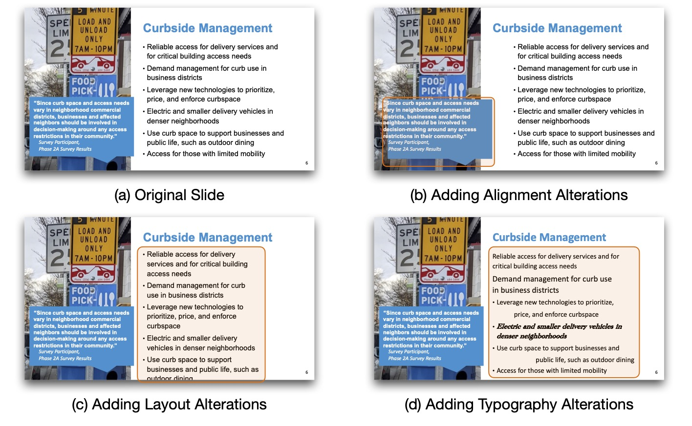
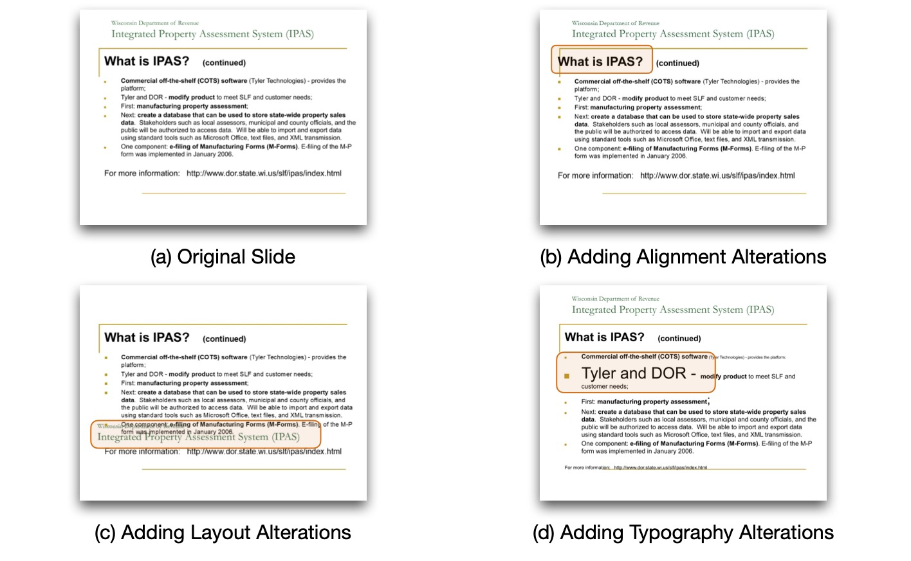
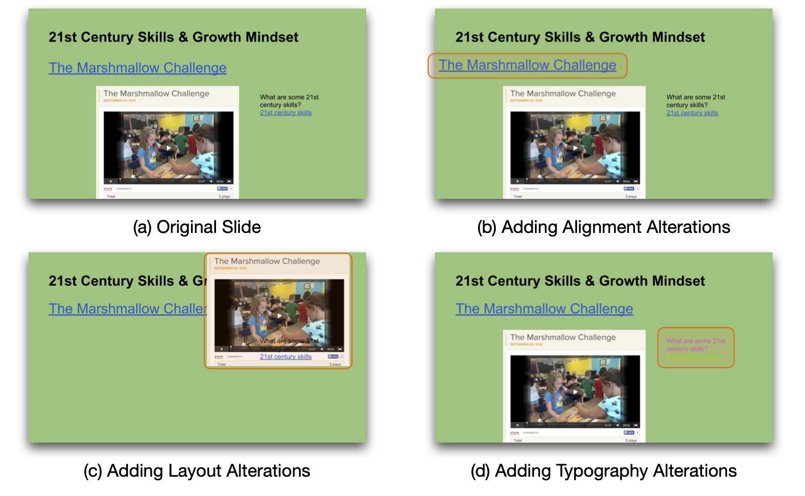

# SlideAudit

**SlideAudit** is a dataset of 2,400 annotated slide images that captures a broad range of design deficiencies across categories like layout, typography, color, and imagery. It supports research in design evaluation, slide generation, and multimodal AI systems.

This dataset accompanies our UIST 2025 paper:

> **SlideAudit: A Dataset for Evaluating Slide Design Deficiencies**
> *Zhuohao (Jerry) Zhang, Ruiqi Chen, Mingyuan Zhong, Jacob O. Wobbrock*
> In *Proceedings of the 38th Annual ACM Symposium on User Interface Software and Technology (UIST ’25)*
> Busan, Republic of Korea, September 28–October 1, 2025.
> DOI: [10.1145/3746059.3747736](https://doi.org/10.1145/3746059.3747736)

---

## Dataset Structure

```
SlideAudit/
├── data/
│   ├── images/              # Raw slide images (slide_XXXX.jpg)
│   ├── annotations/         # Design deficiency annotations (slide_XXXX.json)
│   └── descriptions/        # Slide content object descriptions (slide_XXXX.json)
├── examples/                # Representative alteration examples
│   ├── alteration_example_1.jpg
│   ├── alteration_example_2.jpg
│   └── alteration_example_3.jpg
├── metadata/
│   └── slideaudit_metadata.csv
├── LICENSE
├── README.md
└── CITATION.cff
```

---

## Annotations

Each file in `/data/annotations/` contains:

* `slide_id`: Unique ID (e.g., `slide_0003`)
* `annotations`: List of labeled design deficiencies
* `image_dimensions`: Width and height in pixels

Each design deficiency entry includes:

```json
{
  "design_deficiency_category": "Typography",
  "design_deficiency": "Improper Text Styling",
  "response": true,
  "has_strong_agreement": false,
  "bounding_boxes": [
    { "x": 144.98, "y": 217.28, "width": 802.03, "height": 468.47 }
  ]
}
```

---

## Object Descriptions

Each file in `/data/descriptions/` includes:

* `slide_id`: Matching slide ID (e.g., `slide_0003`)
* `elements`: A list of detected slide elements

  * Each element includes type (e.g., `TEXT_BOX`, `IMAGE`), bounding box (`normalized` position), and either `textContent` or image metadata

Example:

```json
{
  "objectId": "slide_0003_1_PLACEHOLDER",
  "type": "TEXT_BOX",
  "positionAndSize": {
    "normalized": { "x": 0.58, "y": 0.12, "width": 0.37, "height": 0.15 }
  },
  "textContent": "Tomorrow's Tech: Crazy Inventions"
}
```

---

## Example Visuals

Below are three representative examples from the dataset (each image contains a 4-slide grid: original + 3 altered versions):

**Example 1**


**Example 2**


**Example 3**


---

## Metadata

The file `metadata/slideaudit_metadata.csv` contains:

* `slide_id`: Slide identifier (e.g., `slide_0003`)
* `source_type`: Source label extracted from the original filename (e.g., `GDC`, `Google`, `Gemini`)
* `image_width`, `image_height`: Dimensions of the slide image

---

## License

This dataset is released under the [Creative Commons Attribution 4.0 International License (CC BY 4.0)](https://creativecommons.org/licenses/by/4.0/). You are free to use, modify, and distribute this dataset with proper attribution.

---

## Citation

If you use SlideAudit in your work, please cite our paper:

```bibtex
@inproceedings{zhang2025slideaudit,
  author       = {Zhuohao Zhang and others},
  title        = {SlideAudit: A Dataset for Evaluating Slide Design Deficiencies},
  booktitle    = {Proceedings of the 38th Annual ACM Symposium on User Interface Software and Technology (UIST ’25)},
  year         = {2025},
  doi          = {10.1145/3746059.3747736},
  publisher    = {ACM},
  location     = {Busan, Republic of Korea}
}
```

## TODO

We plan to upload useful scripts to this repository soon, including:

* Slide evaluation and scoring utilities
* Metadata inspection and batch processing scripts
